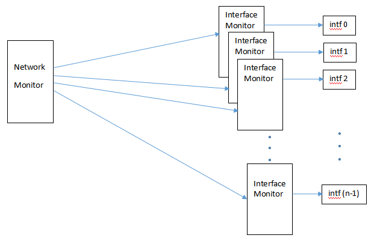
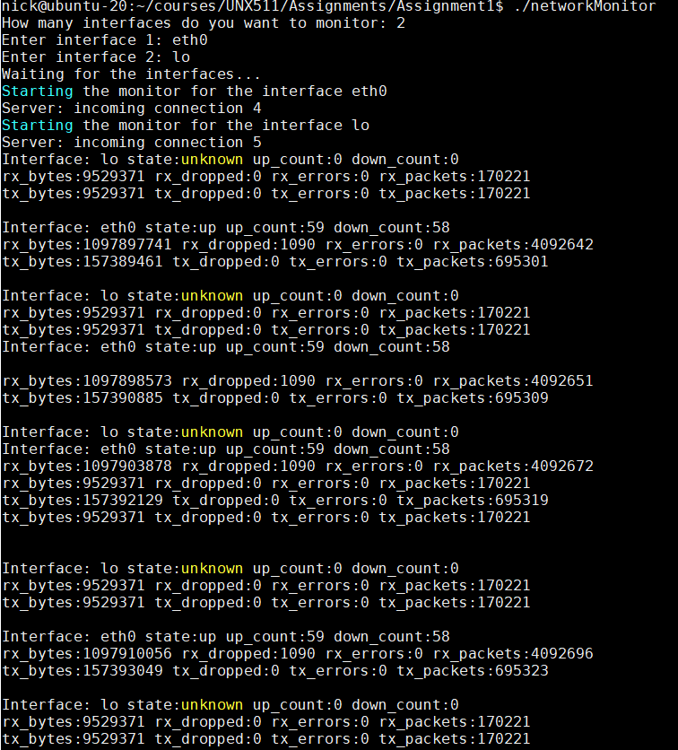

UNX511 -- Assignment 1: A Network Monitor

*Submission Deadline: Sunday, July 10, 2022 by 11:59pm*

**[Business Case] (Marketing, Project Manager, Senior Executives)**

Your job will be to create a network monitor, which monitors the
performance of all network interface devices. Monitoring network
interfaces can help in debugging system problems as well as in enhancing
system performance through a central intelligent networking device.

Currently on our virtual machine, we have two network interfaces:
**eth0** and **lo**. On other machines such as routers, there may be as
many as 64 network interfaces, some of them running in the order of
10GBits/second. For routers and other networking equipment, it is
crucial to know the performance of each interface and to control each
interface, therefore we are going to create a network monitor.

**[Requirements] (Marketing, Project Manager, Project Lead)**

> 1.Our network monitor must be able to monitor any set of network
> interfaces requested by the user.
>
> 2.The statistics for each network interface can be found under\
> Linux's **/sys** directory, specifically
> **/sys/class/net/**\<interface-name\>.
>
> The **/sys** directory is another directory like **/proc** and
> **/dev** which can be accessed to set or obtain information about the
> kernel\'s view of the system.
>
> The statistics to be monitored are:\
> The operating state -- **operstate**\
> The up-count (number of times the interface has been up) --
> **carrier_up_count** The down-count (number of times the interface has
> been down)\
> -- **carrier_down_count**\
> The number of received bytes -- **rx_bytes**\
> The number of dropped received bytes -- **rx_dropped**\
> The number of erroneous received bytes -- **rx_errors**\
> The number of received packets -- **rx_packets**

{width="6.468055555555556in"
height="4.175in"}

**[Implementation] (Junior and Senior Engineers)**

> •The network monitor will communicate with each of its interface
> monitors through a socket file in the **/tmp** directory.
>
> oThe network monitor will create and bind a socket to a temporary
> socket file in the **/tmp** directory. This will be its master file
> descriptor.

oThe network monitor will listen with the master file descriptor.

> oThe network monitor will fork() and exec() all the interface
> monitors, providing the interface name as an argument to each
> interface monitor.
>
> oThe interface monitor will create a socket and attempt to connect to
> the socket file in the **/tmp** directory.
>
> oThe network monitor will now accept all connections storing the file
> descriptor of each connection in an FD_SET.
>
> oThe network monitor now has its master file descriptor and a
> descriptor for each connection with its interface monitors.
>
> oEach interface monitor has now connected to the network monitor.
>
> •The communications between the network monitor and its interface
> monitors is synchronous, in that whenever the network monitor writes
> to an interface monitor, it waits to read something back before
> writing again.
>
> •The communications between the network monitor and its interface
> monitors is with select. When the network monitor receives a message,
> it has to search
>
> •You might have to run your network monitor as super user:
>
> **\$ sudo ./networkMonitor**

•You may wish to insert a DEBUG flag in your Makefile and in your code
to

> perform debug printf's/cout's while debugging. If you make your code
> with your debug flag, then code within the following blocks will be
> executed: **\#ifdef DEBUG**\
> **cout\<\<\"DEBUG:\...\"\<\<endl**\
> **\#endif**\
> When you are satisfied with your code, you can build your code without
> the debug flag.
>
> •When you run your network monitor, compare the statistics that is
> printed out with the values in the
> **/sys/class/net/**\<interface-name\> directory.
>
> •When you run your network monitor, compare the statistics that is
> printed out
>
> with those shown with **\$ ifconfig**.
>
> •To test the link down/link up feature of your interface monitor, put
> a link down (for example lo) with the following command from the
> command line:\
> **\$ sudo ip link set lo down**\
> Your interface monitor should indicate that the link is down
> temporarily, then indicate when it has come back up. Your up_count and
> down_count should each increment by one as well.
>
> •A correctly running network monitor will look something like:
>
> {width="6.5in"
> height="7.1875in"}
